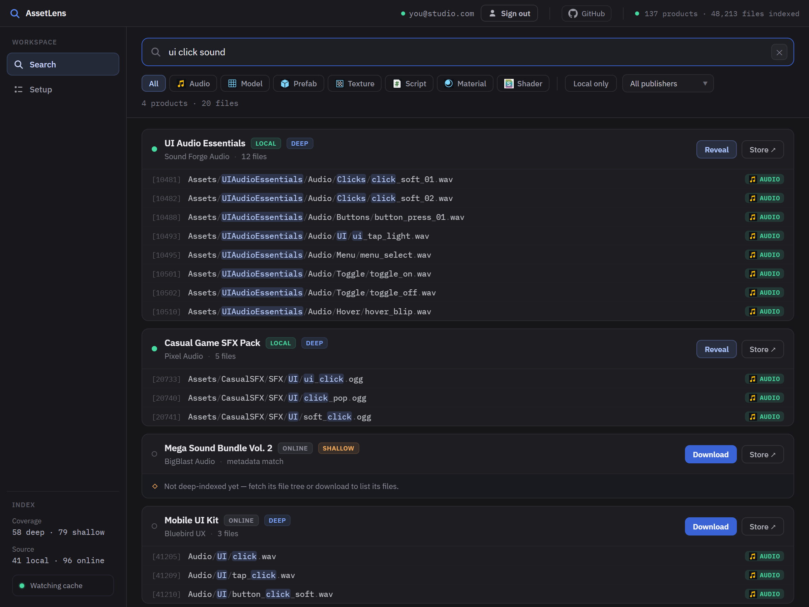
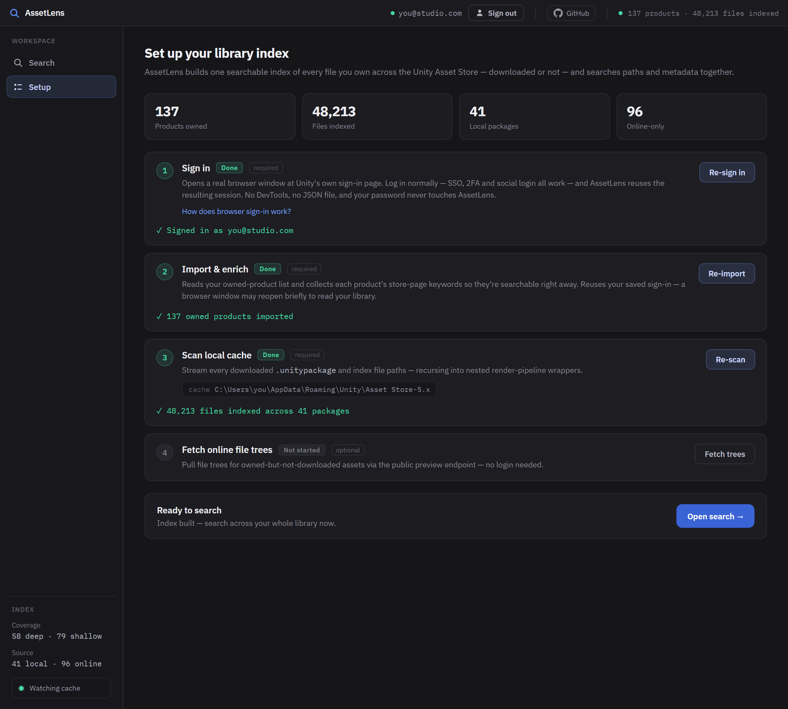
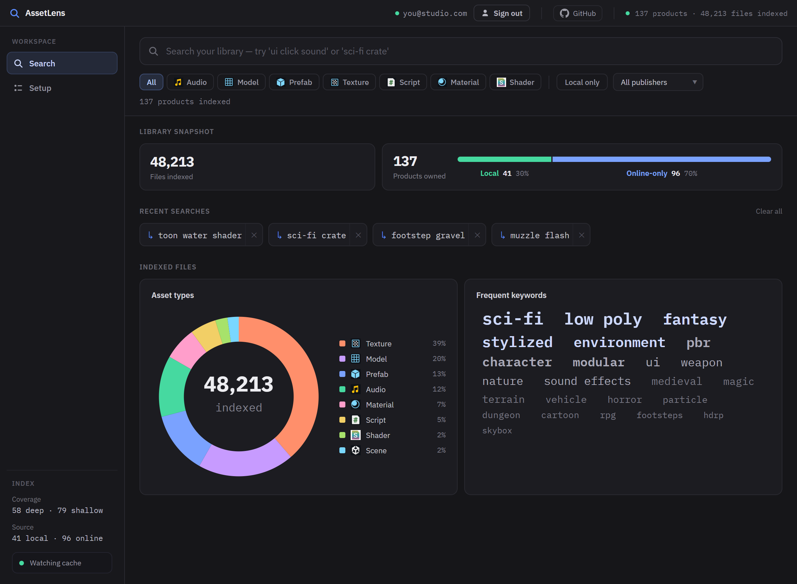

# 🔍 AssetLens

**Find any file in your Unity Asset Store library — instantly, by keyword.**

You own dozens (maybe hundreds) of Asset Store packages. Somewhere in there is the
perfect *UI click sound*, *sci-fi crate*, or *toon water shader* — but which pack
was it in? Was it even downloaded? AssetLens answers that in one search box.



AssetLens builds **one searchable index of every file you own** — across your
downloaded `.unitypackage` cache *and* assets you own but haven't downloaded yet
— and lets you search them all at the **individual-file level**. It even looks
inside mega-bundles with thousands of files and nested render-pipeline packages.

It only ever reads **metadata and file paths you're entitled to**. It never
rehosts, copies, or redistributes asset contents.

---

## ⚡ Quick start

```bash
git clone https://github.com/Torcheye/unity-asset-lens.git assetlens && cd assetlens
npm install
npm run build && npm link     # makes the `assetlens` command available

assetlens serve               # 🚀 opens the web app in your browser
```

That's it. The web app walks you through the rest — sign in, build the index,
and search. **Requires [Node.js](https://nodejs.org) 20 or newer.**

> Just trying it out? Skip `npm link` and run the app straight from source:
> `npm run cli -- serve`

---

## 🖥️ The web app (recommended)

`assetlens serve` launches a local web app and opens it in your browser. It's a
friendly front-end over the same engine — no terminal required after this point.
Everything runs on your machine over loopback (`127.0.0.1`); **nothing is ever
sent to a third party.**

```bash
assetlens serve                 # start + open browser (http://127.0.0.1:4317)
assetlens serve --port 8080     # pick a different port
assetlens serve --no-open       # start without auto-opening the browser
```

### The flow, end to end

**1 · Set up your index** — guided cards with live progress bars. Sign in through
Unity's own login page, import your owned catalog (with store-page keywords),
scan your downloaded `.unitypackage` cache, and optionally fetch file trees for
assets you haven't downloaded. Run them in order the first time; re-run any one
whenever your library changes.



**2 · See your library at a glance** — products owned, files indexed, local vs.
online-only, an asset-type breakdown, and a keyword cloud where any word is a
one-click search.



**3 · Search & act** — type a query for results grouped by product (shown at the
top of this page). Filter by type, publisher, or "downloaded only". Then, per
result: **Reveal** the file in your file manager, open the **Store** page, or
**Download** via Unity Package Manager. Results you haven't downloaded yet still
appear (matched on product metadata), so you always know what you own.

Once **Import** and **Scan** are done, the search box unlocks.

---

## ⌨️ Prefer the terminal?

Every web-app action has a CLI equivalent. The same setup flow:

```bash
assetlens login        # 1. browser sign-in → owned catalog + keywords imported
assetlens scan         # 2. index your downloaded .unitypackage cache
assetlens fetch        # 3. (optional) file trees for not-yet-downloaded assets

assetlens search ui click sound
assetlens search "sci-fi crate" --type model --local
```

| Command | What it does |
|---|---|
| `assetlens login` | Browser sign-in, then import your owned catalog + store-page keywords |
| `assetlens scan` | Index your downloaded `.unitypackage` cache (auto-detected per OS) |
| `assetlens fetch` | Pull file trees for owned-but-not-downloaded assets (no login needed) |
| `assetlens search <query…>` | Search by filename + path. Flags: `--type`, `--local`, `--publisher`, `--limit`, `--json` |
| `assetlens reveal <fileId>` | Reveal a downloaded file in your file manager |
| `assetlens open <productId>` | Open the product's store page |
| `assetlens download <productId>` | Open Unity Package Manager to download it |
| `assetlens watch` | Auto-index packages as Unity finishes downloading them |
| `assetlens serve` | Launch the web app (alias: `gui`) |
| `assetlens stats` · `publishers` | Index statistics / indexed publisher list |

`reveal` / `open` / `download` IDs come from the bracketed numbers and product IDs
in `assetlens search` output. Run `assetlens` with no arguments for full help.

> **Re-pull keywords after an upgrade:** `assetlens enrich --force` refreshes each
> product's store-page *Related keywords* (the signal behind the keyword cloud).

---

## 🔐 Signing in (the one setup step)

Listing your owned catalog needs your logged-in Unity session. **AssetLens never
handles your password** — it only ever goes into Unity's own login page.

When you sign in (the web app's step ①, or `assetlens login`), AssetLens opens a
real browser window pointed at Unity's sign-in page. You log in there normally —
**SSO, 2FA, and social login all work**. Once you're authenticated, it reads your
owned-product list from the same `CurrentUser` request the *My Assets* page makes,
then imports your products. No DevTools, no JSON file, no credential handling.

By default your session is remembered locally so you can skip the login screen
next time. Clear it any time:

```bash
assetlens login --no-remember   # don't persist the session
assetlens logout                # forget the saved session
```

This uses [Playwright](https://playwright.dev) driving your **already-installed
default browser** (Chrome or Edge — no separate download). `playwright-core` is an
*optional* dependency; if it wasn't installed automatically, run it once:
`npm install playwright-core`.

> Already have a catalog export? Import it offline with
> `assetlens import <file.json>` (accepts a bare array of product nodes).
> Fetching public preview content needs **no login** at all.

---

## ⚙️ Configuration

AssetLens auto-detects your Asset Store cache, but you can override both the
index location and the cache root:

| Setting | Flag | Environment variable |
|---|---|---|
| Index database location | `--db <path>` | `ASSETLENS_DATA_DIR` |
| Asset Store cache root | `--cache-root <path>` | `ASSETLENS_CACHE_ROOT` |

The remembered browser session lives alongside the index in the data dir.

**Default cache roots:**

| OS | Path |
|---|---|
| Windows | `%APPDATA%\Unity\Asset Store-5.x` |
| macOS | `~/Library/Unity/Asset Store-5.x` |
| Linux | `~/.local/share/unity3d/Asset Store-5.x` |

---

## 🧩 How it works (under the hood)

| Stage | What happens |
|---|---|
| **Browser login** | Drives your installed browser to Unity's login page; reads owned IDs from the `CurrentUser` response, then batches `Product` queries for details. No credential handling; session persisted locally. |
| **Catalog import** | Tolerant parser for the owned-product list (and captured catalog JSON). |
| **Store-page keywords** | One public product-page request per product adds its **category + related keywords** — the strongest signal for keyword matching, and the source of the GUI keyword cloud. |
| **Local scan** | Streams each `.unitypackage` tar reading only path members; recurses nested `.unitypackage` wrapper blobs (tar-in-tar); incremental by mtime/size. |
| **Online fetch** | Reconstructs file trees from the public `PreviewAssets` content tree for assets you own but haven't downloaded. |
| **Index & search** | SQLite **FTS5** index; ranks *filename > path > metadata* with a local-product boost; groups by product; filters by type / publisher / downloaded-only. |
| **Actions** | Reveal file · open store page · `com.unity3d.kharma:` download deep-link · live cache watcher. |

---

## 📦 Embed it in your own code

AssetLens is also a library. The high-level engine:

```ts
import { AssetLensEngine } from "assetlens";

const engine = AssetLensEngine.open();
await engine.loginAndImport();          // browser sign-in → owned catalog imported
await engine.scanLocal();
const results = engine.search("ui click sound", { typeBucket: "audio" });
engine.close();
```

Start the web app from code with `startGuiServer({ port })`, or reach for the
lower-level pieces (`parseUnityPackageFile`, `fetchOnlineProductTree`,
`Repository`, `searchFiles`, …). See [`src/index.ts`](./src/index.ts) and
[`src/server`](./src/server).

---

## 📝 Notes & limitations

- AssetLens uses **undocumented** Asset Store operations (`CurrentUser`,
  `Product`, `PreviewAssets`) that may change without notice. They live in one
  place — [`src/store/constants.ts`](./src/store/constants.ts) — so they're easy
  to refresh from DevTools → Network if they ever break.
- **UPM-format** Asset Store content (stored in the global package cache) is out
  of scope for this version.
- Be a good citizen: AssetLens throttles online requests and caches aggressively.
  You are responsible for complying with the
  [Unity Asset Store Terms of Service](https://unity.com/legal/as-terms).

---

## 🛠️ Development

```bash
npm run cli -- <command>   # run the CLI from source, no build needed
npm test                   # unit test suite (vitest)
npm run test:coverage
npm run typecheck

node tools/gen-screenshots.mjs   # regenerate the README screenshots (docs/img/)
```

## License

MIT — see [LICENSE](./LICENSE).
